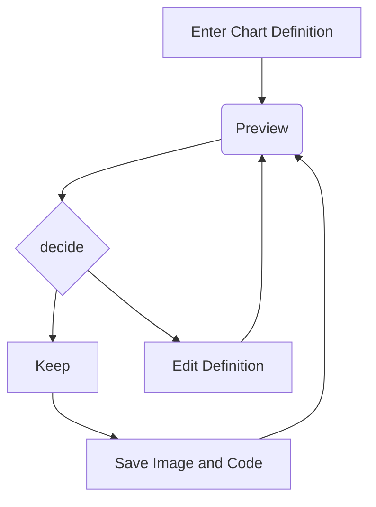
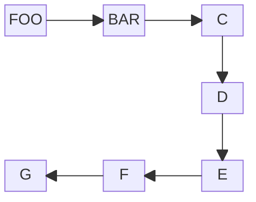

TODO Copy from image 18/12/2025 09:43

# Mock 1(?) Q3
## a.
Prewarping steps
0. Determine normalised digital frequency:
$$
	\Omega_o = \frac{2\pi \cdot f_s}{f_s} 
		= \frac{2\pi \cdot 500}{2000}
		= \frac{1000\pi}{2000}
		= \frac\pi2
$$
## b.
Determine the z-domain transfer function using the Bilinear Transformation:
$$
\begin{align}
	G(z) &= \dots \\
	G(s)|_{\large s=2f_s\frac{(z-1)}{z+1}} &=  \frac
		{
			\left( \frac {2f_s (z-1)} {(z+1)} 
				\times \frac1{4000}
			\right)^2
		}
		{
			\left( \frac{2f_s (z-1)} {(z+1)} \times \frac1{4000^2} \right) +
			\left( \sqrt2 \times \frac{2f_s (z-1)} {(z+1)} \times \frac1{4000} + 1 \right)
		} \\ \\
	
	&\text{Noting that } 2f_s=4000, \\
	G(z) &= \frac
		{
			\left(
				\frac{\cancel{4000}}{\cancel{4000}} \cdot
				\left( \frac{z-1}{z+1} \right)
			\right)^2
		}
		{
			\left(
				\frac{\cancel{4000}}{\cancel{4000}} \cdot
				\left( \frac{z-1}{z+1} \right)
			\right)^2
			+ \sqrt2 \cdot
				\frac{\cancel{4000}}{\cancel{4000}} \cdot
				\left( \frac{z-1}{z+1} \right)
			+ 1
		} \\ \\
	
	&= \frac
		{
			\left( \frac{z-1}{z+1} \right)^2
		}
		{
			\left( \frac{z-1}{z+1} \right)^2
			+ \sqrt2 \cdot
				\left( \frac{z-1}{z+1} \right)
			+ 1
		} \times \frac{(z-1)^2}{(z+1)^2} \\ \\
		
	&= \frac
		{ (z-1)^2 }
		{ (z-1)^2 + \sqrt2 \cdot (z-1)(z+1) + (z+1)^2 } \\
	
	&\cdots
\end{align}
$$
TODO many pictures

Multiply and Accumulate (MAC): Each filter multiplied and followed by a sum is classed as a single MAC, which is such a common operation that many DSP devices have dedicated silicon space to it.
Central Processing Units (CPUs) are often specified in terms of how long a MAC requires to compute.

# Mock 1 Q9
## f.
Sampling frequency, $f_s=48000 \text{ Hz}$
Sample time, $T_s = \frac1{f_s} = 2.0833\times10^{-5}$ seconds, or $T_s = 20.833\: \micro\text{s}$, or $T_s = 20833 \text{ ns}$

# Mock 1 Q8
## a.
DSP system with analogue input and output:
$$
%% Holy fuck this was far too much effort
\begin{gather}
	&\begin{array}{c}
		\text{Analogue} \\
		\text{Signal} \\
		\text{Input}
	\end{array}
	&\rightarrow
	&\begin{array}{c}
		\boxed{
			\begin{gather}
				\text{Analogue} \\
				\text{Low-pass Filter}
			\end{gather}
		} \\
		\text{Antialiasing filter}
	\end{array}
	&\rightarrow
	&\boxed{
		\begin{gather}
			\text{Analogue to Digital} \\
			\text{Converter (ADC)}
		\end{gather}
	} \\
	
	&&&&&\downarrow \\
	
	&&&&&\boxed{
		\begin{gather}
			\text{Digital} \\
			\text{Processing}
		\end{gather}
	} \\
		
	&&&&&\downarrow \\
	
	&\begin{array}{c}
		\text{Analogue} \\
		\text{Signal} \\
		\text{Output}
	\end{array}
	&\leftarrow
	&\begin{array}{c}
		\boxed{
			\begin{gather}
				\text{Analogue} \\
				\text{Low-pass Filter}
			\end{gather}
		} \\
		\text{Reconstruction filter}
	\end{array}
	 &\leftarrow
	 &\boxed{
		\begin{gather}
			\text{Digital to Analogue} \\
			\text{Converter (DAC)}
		\end{gather}
	}
\end{gather}
$$

